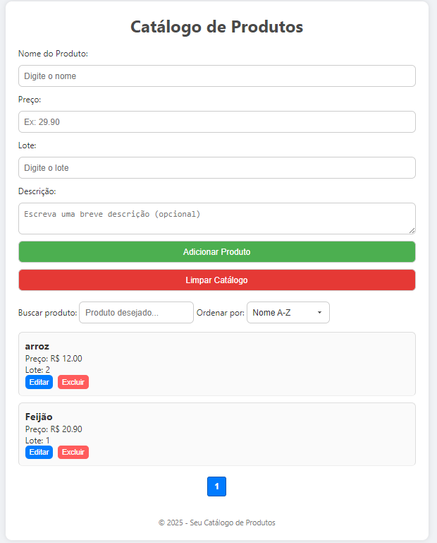

# Catálogo de Produtos

Este projeto foi desenvolvido como parte da disciplina Eletiva Programação WEB, com o objetivo de aplicar os conceitos fundamentais de desenvolvimento front-end utilizando HTML, CSS e JavaScript. O catálogo de produtos foi criado para demonstrar na prática o funcionamento de um sistema dinâmico que interage com o usuário, manipula dados e utiliza o localStorage para persistência de informações.

## Contexto Acadêmico 🎓
Este trabalho foi realizado como atividade avaliativa da matéria Eletiva Programação WEB, que tem como foco o ensino das tecnologias essenciais para o desenvolvimento de aplicações web interativas. O projeto permitiu explorar:

Manipulação do DOM para renderização dinâmica de elementos.

Eventos em JavaScript para capturar interações do usuário.

Armazenamento local (localStorage) para persistência de dados.

Técnicas de estilização responsiva com CSS.

Lógica de programação para ordenação, busca e paginação.

O desenvolvimento deste catálogo reforçou conceitos importantes da disciplina, como a estruturação de um projeto front-end e a criação de uma interface funcional e intuitiva.

## Funcionalidades 🛠️

✅ Adicionar Produtos: O formulário permite adicionar novos produtos com nome, preço, lote e descrição (opcional).

✅ Edição de Produtos: Permite editar os produtos já adicionados.

✅ Remoção de Produtos: Os produtos podem ser removidos individualmente.

✅ Busca de Produtos: A busca permite encontrar produtos pelo nome.

✅ Ordenação de Produtos: Os produtos podem ser ordenados por nome (A-Z, Z-A) ou por preço (crescente ou decrescente).

✅ Paginação: A lista de produtos é paginada, exibindo 5 produtos por vez.

✅ Armazenamento Local: Os produtos são armazenados no localStorage, garantindo persistência dos dados.

---

## Tecnologias Utilizadas 💻

🖥️ HTML – Estrutura da página e do formulário.

🎨 CSS – Estilização da interface.

⚙️ JavaScript – Lógica de manipulação de produtos, busca, ordenação e armazenamento local.

